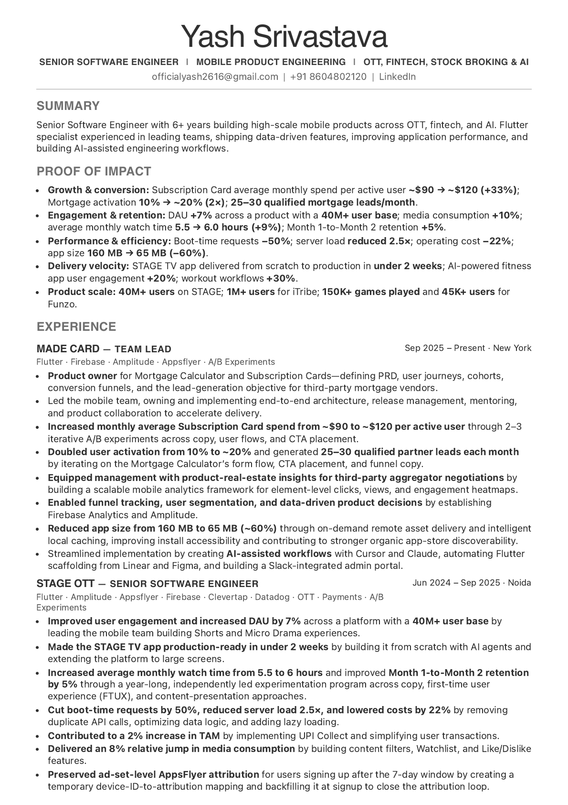
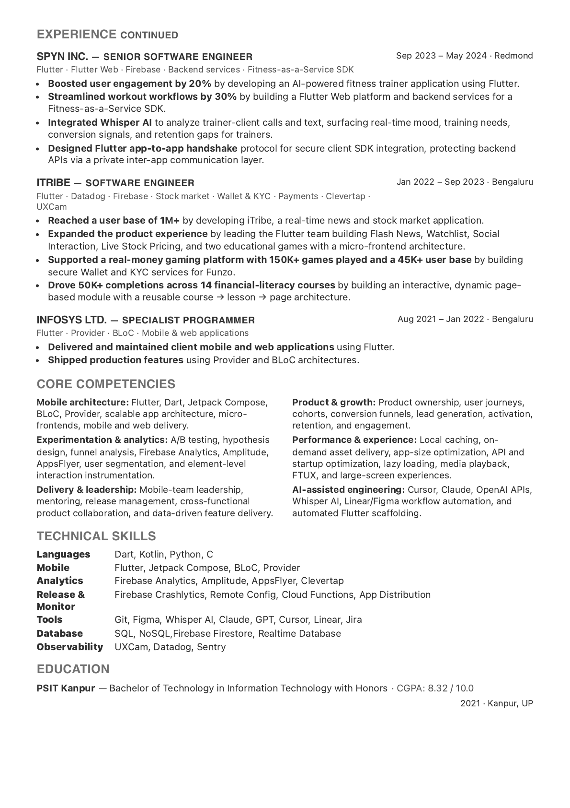

# Yash Srivastava — Resume

A responsive, print-ready two-page CV for Yash Srivastava, Senior Software Engineer.

## Preview

  
  

## View or print

Open [index.html](index.html) in a modern browser. For the intended A4 layout, use the browser's print dialog and select **Save as PDF** with background graphics enabled.

## Files

- `index.html` — two-page CV content
- `styles.css` — two-page CV screen and print styling
- `one-page-cv/` — archived one-page resume, including its print stylesheet
- `assets/two-page-preview-1.png` and `assets/two-page-preview-2.png` — README preview images
